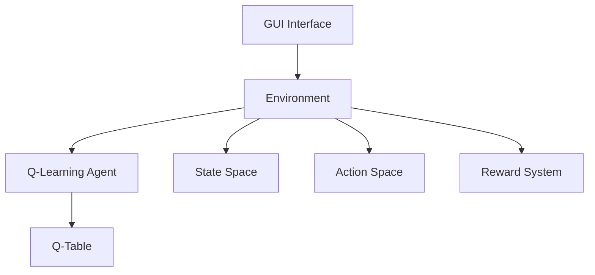

# Reinforcement Learning Maze Solver

A Python-based implementation of Q-Learning algorithm for solving maze navigation problems with a graphical user interface.

## Project Structure

```
RL_GridWorldPro_demo/
├── maze_RL/
│   ├── maze_RL_PRO.py    # Main GUI application
│   ├── maze_RL.py        # Core Q-learning implementation
│   └── maze_RL.md        # Algorithm documentation
└── README.md             # Project documentation
```

## System Architecture



## Features

- Interactive GUI for maze visualization and training control
- Configurable grid size and number of traps
- Adjustable learning parameters:
  - Learning rate (α)
  - Discount factor (γ)
  - Exploration rate (ε)
- Real-time training progress visualization
- Optimal path visualization after training

## Q-Learning Implementation

### State-Action Space
```
Grid World (4x4 example):
+---+---+---+---+
| S |   |   |   |
+---+---+---+---+
|   | T |   |   |
+---+---+---+---+
|   |   |   |   |
+---+---+---+---+
|   |   |   | G |
+---+---+---+---+

Legend:
S: Start
T: Trap
G: Goal/Treasure
```

### Q-Table Structure
```
Q-Table (State × Action):
+--------+------+--------+-------+--------+
| State  | Up   | Down   | Left  | Right  |
+--------+------+--------+-------+--------+
| 0      | Q00  | Q01    | Q02   | Q03    |
| 1      | Q10  | Q11    | Q12   | Q13    |
| ...    | ...  | ...    | ...   | ...    |
| 15     | Q150 | Q151   | Q152  | Q153   |
+--------+------+--------+-------+--------+
```

## Learning Process

1. **Initialization**
   - Create Q-table with zeros
   - Set learning parameters
   - Initialize environment

2. **Training Loop**
   ```
   For each episode:
       Initialize state
       While not done:
           Choose action (ε-greedy)
           Take action, observe reward
           Update Q-value
           Move to next state
   ```

3. **Q-Value Update**
   ```
   Q(s,a) ← Q(s,a) + α[r + γ max Q(s',a') - Q(s,a)]
   Where:
   - α: Learning rate
   - γ: Discount factor
   - r: Immediate reward
   - s': Next state
   - a': Next action
   ```

## Usage

1. Run the main application:
   ```bash
   python maze_RL/maze_RL_PRO.py
   ```

2. Configure parameters in the GUI:
   - Grid size
   - Number of traps
   - Learning parameters
   - Training episodes

3. Click "Initialize" to set up the environment

4. Click "Start Training" to begin the learning process

5. View results and optimal path using "Show Results"

## Dependencies

- Python 3.x
- NumPy
- Tkinter (included in standard Python installation)

## Performance Metrics

The system tracks and displays:
- Success rate
- Trap hit rate
- Average reward
- Average steps per episode
- Training time

## Future Improvements

- [ ] Add support for custom maze layouts
- [ ] Implement additional RL algorithms
- [ ] Add training visualization graphs
- [ ] Support for saving/loading trained models
- [ ] Multi-agent support
