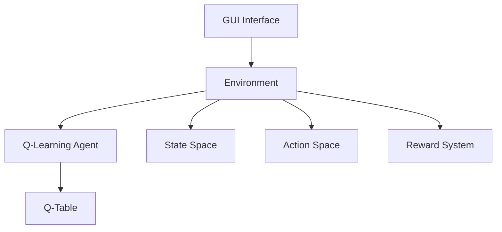

# Reinforcement Learning Maze Solver

A Python-based implementation of Q-Learning algorithm for solving maze navigation problems with a graphical user interface.

## Project Structure

```
RL_GridWorldPro_demo/
├── maze_RL/
│   ├── maze_RL_PRO.py    # Main GUI application
│   ├── maze_RL.py        # Core Q-learning implementation
│   └── maze_RL.md        # Algorithm documentation
└── README.md             # Project documentation
```

## System Architecture



## Features

- Interactive GUI for maze visualization and training control
- Configurable grid size and number of traps
- Adjustable learning parameters:
  - Learning rate (α)
  - Discount factor (γ)
  - Exploration rate (ε)
- Real-time training progress visualization
- Optimal path visualization after training

## Q-Learning Implementation

### State-Action Space
```
Grid World (4x4 example):
+---+---+---+---+
| S |   |   |   |
+---+---+---+---+
|   | T |   |   |
+---+---+---+---+
|   |   |   |   |
+---+---+---+---+
|   |   |   | G |
+---+---+---+---+

Legend:
S: Start
T: Trap
G: Goal/Treasure
```

### Q-Table Structure
```
Q-Table (State × Action):
+--------+------+--------+-------+--------+
| State  | Up   | Down   | Left  | Right  |
+--------+------+--------+-------+--------+
| 0      | Q00  | Q01    | Q02   | Q03    |
| 1      | Q10  | Q11    | Q12   | Q13    |
| ...    | ...  | ...    | ...   | ...    |
| 15     | Q150 | Q151   | Q152  | Q153   |
+--------+------+--------+-------+--------+
```

## Learning Process

1. **Initialization**
   - Create Q-table with zeros
   - Set learning parameters
   - Initialize environment

2. **Training Loop**
   ```
   For each episode:
       Initialize state
       While not done:
           Choose action (ε-greedy)
           Take action, observe reward
           Update Q-value
           Move to next state
   ```

3. **Q-Value Update**
   ```
   Q(s,a) ← Q(s,a) + α[r + γ max Q(s',a') - Q(s,a)]
   Where:
   - α: Learning rate
   - γ: Discount factor
   - r: Immediate reward
   - s': Next state
   - a': Next action
   ```

## Usage

1. Run the main application:
   ```bash
   python maze_RL/maze_RL_PRO.py
   ```

2. Configure parameters in the GUI:
   - Grid size
   - Number of traps
   - Learning parameters
   - Training episodes

3. Click "Initialize" to set up the environment

4. Click "Start Training" to begin the learning process

5. View results and optimal path using "Show Results"

## Dependencies

- Python 3.x
- NumPy
- Tkinter (included in standard Python installation)

## Performance Metrics

The system tracks and displays:
- Success rate
- Trap hit rate
- Average reward
- Average steps per episode
- Training time

## Future Improvements

- [ ] Add support for custom maze layouts
- [ ] Implement additional RL algorithms
- [ ] Add training visualization graphs
- [ ] Support for saving/loading trained models
- [ ] Multi-agent support

## License

This project is licensed under the MIT License - see the details below:

```
MIT License

Copyright (c) 2024 RL_GridWorldPro_demo

Permission is hereby granted, free of charge, to any person obtaining a copy
of this software and associated documentation files (the "Software"), to deal
in the Software without restriction, including without limitation the rights
to use, copy, modify, merge, publish, distribute, sublicense, and/or sell
copies of the Software, and to permit persons to whom the Software is
furnished to do so, subject to the following conditions:

The above copyright notice and this permission notice shall be included in all
copies or substantial portions of the Software.

THE SOFTWARE IS PROVIDED "AS IS", WITHOUT WARRANTY OF ANY KIND, EXPRESS OR
IMPLIED, INCLUDING BUT NOT LIMITED TO THE WARRANTIES OF MERCHANTABILITY,
FITNESS FOR A PARTICULAR PURPOSE AND NONINFRINGEMENT. IN NO EVENT SHALL THE
AUTHORS OR COPYRIGHT HOLDERS BE LIABLE FOR ANY CLAIM, DAMAGES OR OTHER
LIABILITY, WHETHER IN AN ACTION OF CONTRACT, TORT OR OTHERWISE, ARISING FROM,
OUT OF OR IN CONNECTION WITH THE SOFTWARE OR THE USE OR OTHER DEALINGS IN THE
SOFTWARE.
```

### What MIT License Means for Users

- ✅ **Commercial Use**: You can use this software in commercial projects
- ✅ **Modification**: You can modify the source code
- ✅ **Distribution**: You can distribute the original or modified software
- ✅ **Private Use**: You can use it privately
- ✅ **Patent Use**: You can use any patents included in the code
- ✅ **Sublicensing**: You can sublicense the software

The only requirement is that you must include the original copyright notice and license text in any substantial portions of the software. 